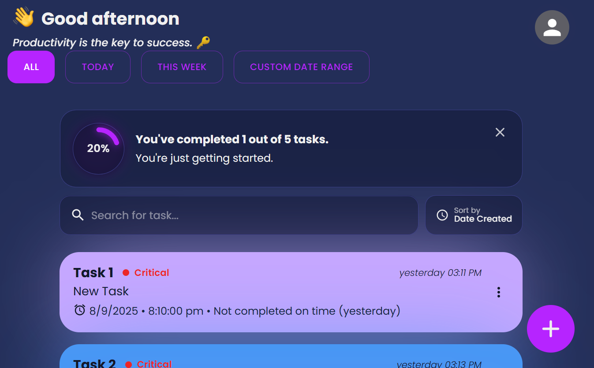
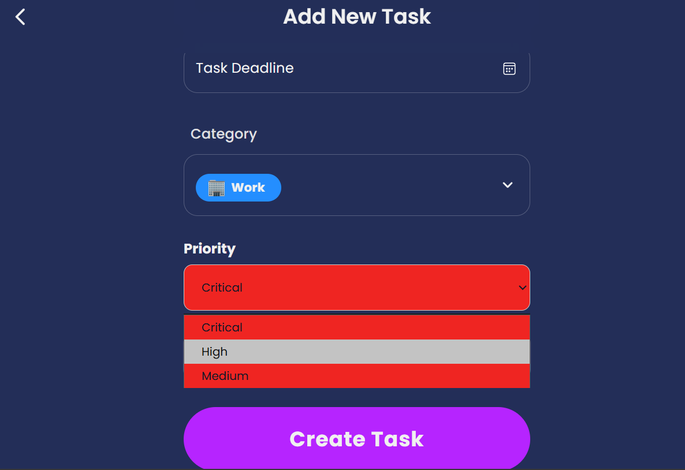
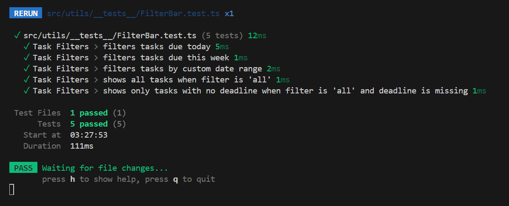
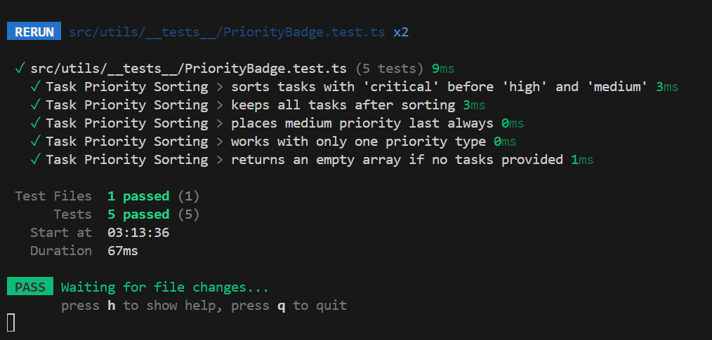
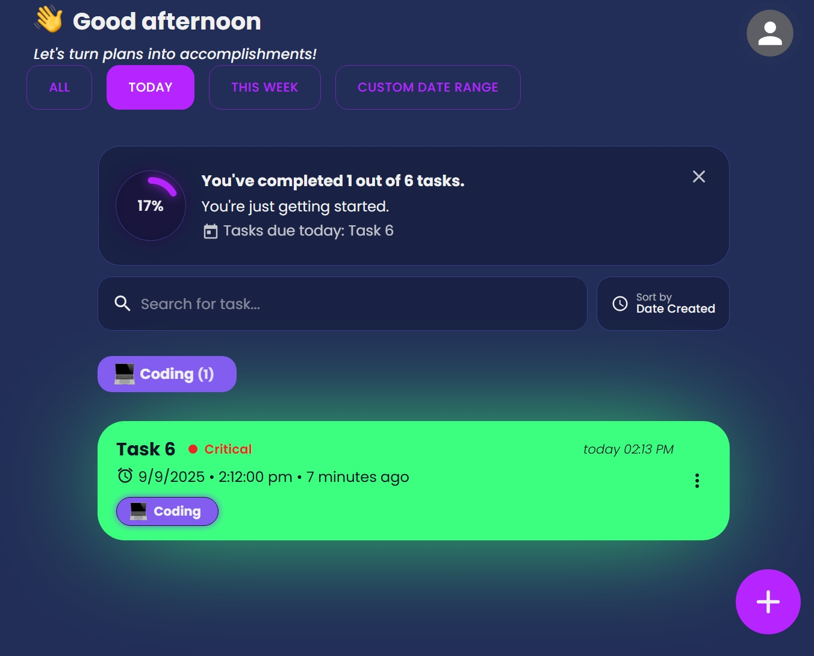
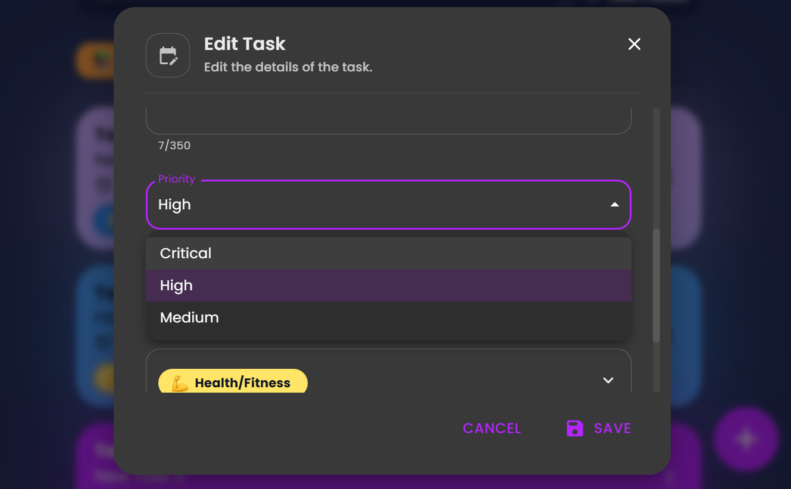
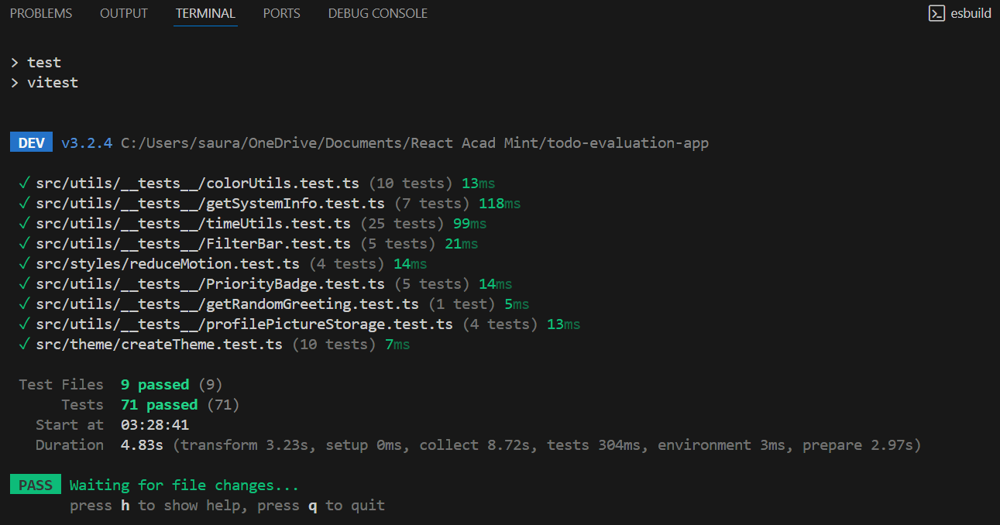

<!-- 

 -->

# 📝React.js Todo App

<i>A fast and modern Todo app built with React, featuring task sharing via link, P2P Task Sync with WebRTC, theme customization, offline usage as a PWA, and caching for smooth performance.</i>

## [https://react-cool-todo-app.netlify.app/](https://react-cool-todo-app.netlify.app/)

<!-- 

 -->

## 💻 Tech Stack

<ul style="display: flex; flex-direction: column; gap:10px;">
  <li style="vertical-align: middle;">
     React
  </li>
    <li style="vertical-align: middle;">
     Typescript
  </li>
    <li style="vertical-align: middle;">
     Vite
  </li>
  <li style="vertical-align: middle;">
     Vitest
  </li>
  <li style="vertical-align: middle;">
     Emotion
  </li>
    <li style="vertical-align: middle;">
     Material UI (MUI)
  </li>
</ul>

## ⚡ Features

- 🔗 **Share Tasks by Link or QR Code** → Easily share your tasks with others using a link or QR code.
- 🎨 **Color Themes & Dark Mode** → Choose from various color themes and toggle between light and dark modes.
- 🗣️ **Task Reading Aloud** → Read tasks aloud using the `SpeechSynthesis` API.
- 📥 **Import/Export Tasks** → Backup and transfer tasks as JSON.
- 📴 **Progressive Web App (PWA)** → Installable, offline support, native-like usage.
- 🔄 **Update Prompt** → Notifies when a new version is available.
- 📱 **Custom Splash Screens** → Native-like smooth startup screens.
- 📅 **FilterBar** → Filter tasks by **Today**, **This Week**, or a **custom date range**.
- 🚨 **Task Priority Levels** → Assign **Critical**, **High**, or **Medium** priority to tasks with color-coded labels.
- 🧪 **Tests** → Added unit testing for filtersBar and PriorityBadge.

---

### 📅 Task Filters

Organize your tasks using built-in filters:

- **Today** → Shows only tasks due today
- **This Week** → Displays tasks due within the current week
- **Custom Date Range** → Select a custom date range using date pickers

---

### 🚨 Task Priority Levels

While adding or editing a task, you can now assign **priority levels**:

- 🔴 **Critical** (red)
- 🟡 **High** (yellow)
- 🟣 **Medium** (purple)

Each task card displays:

- A **colored circle** representing the priority
- A **priority label** (Critical / High / Medium)

---

### 🧪 Tests

This project includes unit tests written with Vitest and React Testing Library.
**To run all test cases, use:** `npm run test`

---

## 👨‍💻 Installation

To install and run the project locally, follow these steps:

- Clone the repository: `git clone https://github.com/Ssaurabhs/TodoAcadmint`
- Navigate to the project directory: `cd TodoAcadmint`
- Install the dependencies: `npm install`
- Start the development server: `npm run dev`

The app will now be running at [http://localhost:5173/](http://localhost:5173/).

> [!TIP]
> For mobile device testing, use `npm run dev:host` to preview the app on your local network with HTTPS (required for camera features) and a QR code in the terminal for quick access. To enable PWA features in development, see `vite.config.ts`.

## 📷 Screenshots

## 🚀 Performance

## Credits

licensed under [MIT](https://github.com/maciekt07/TodoApp/blob/main/LICENSE).
